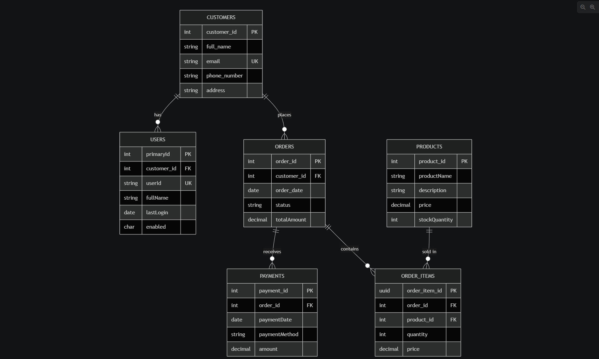

# Data Model

The following entity relationship diagram illustrates the database schema:



---

## Entities

### `Customers`
| Column | Type | Constraints |
|---|---|---|
| `customer_id` | INT | PK, auto-increment |
| `full_name` | VARCHAR(100) | NOT NULL |
| `email` | VARCHAR(100) | NOT NULL, UNIQUE |
| `phone_number` | VARCHAR(15) | nullable |
| `address` | VARCHAR | nullable |

### `Users`
| Column | Type | Constraints |
|---|---|---|
| `primaryId` | INT | PK, auto-increment |
| `customer_id` | INT | FK → `customers.customer_id` |
| `userId` | VARCHAR(50) | NOT NULL, UNIQUE |
| `fullName` | VARCHAR(100) | NOT NULL |
| `lastLogin` | DATETIME | nullable |
| `enabled` | CHAR(1) | NOT NULL (`Y` / `N`) |

### `Products`
| Column | Type | Constraints |
|---|---|---|
| `product_id` | INT | PK, auto-increment |
| `product_name` | VARCHAR(100) | NOT NULL |
| `description` | VARCHAR | nullable |
| `price` | DECIMAL(10,2) | NOT NULL |
| `stock_quantity` | INT | NOT NULL |

### `Orders`
| Column | Type | Constraints |
|---|---|---|
| `order_id` | INT | PK, auto-increment |
| `customer_id` | INT | FK → `customers.customer_id` |
| `order_date` | DATETIME | nullable |
| `status` | VARCHAR(20) | nullable |
| `total_amount` | DECIMAL(10,2) | NOT NULL |

**Order status lifecycle:**
```
Pending ──► Submitted ──► Shipped
   │
   └──► Cancelled

Submitted / Shipped ──► "refunded"
                    ──► "partially refunded"
```

> **Note:** The refund statuses are stored as lowercase strings (`"refunded"`, `"partially refunded"`) in the database, as set by `PaymentService`. All other statuses use title case.

### `OrderItems`
| Column | Type | Constraints |
|---|---|---|
| `order_item_id` | UUID | PK |
| `order_id` | INT | FK → `orders.order_id` |
| `product_id` | INT | FK → `products.product_id` |
| `quantity` | INT | NOT NULL |
| `price` | DECIMAL(10,2) | NOT NULL |

### `Payments`
| Column | Type | Constraints |
|---|---|---|
| `payment_id` | INT | PK, auto-increment |
| `order_id` | INT | FK → `orders.order_id` |
| `payment_date` | DATETIME | nullable |
| `payment_method` | VARCHAR(50) | nullable |
| `amount` | DECIMAL(10,2) | NOT NULL |

---

## Relationships

```
Customers ──< Orders ──< OrderItems >── Products
    │               └──< Payments
    └──< Users
```

- A **Customer** can have many **Orders** and many **Users**.
- An **Order** can have many **OrderItems** and at most one **Payment**.
- An **OrderItem** references one **Product**.
- A **Payment** belongs to one **Order**.
- A **User** belongs to one **Customer**.
